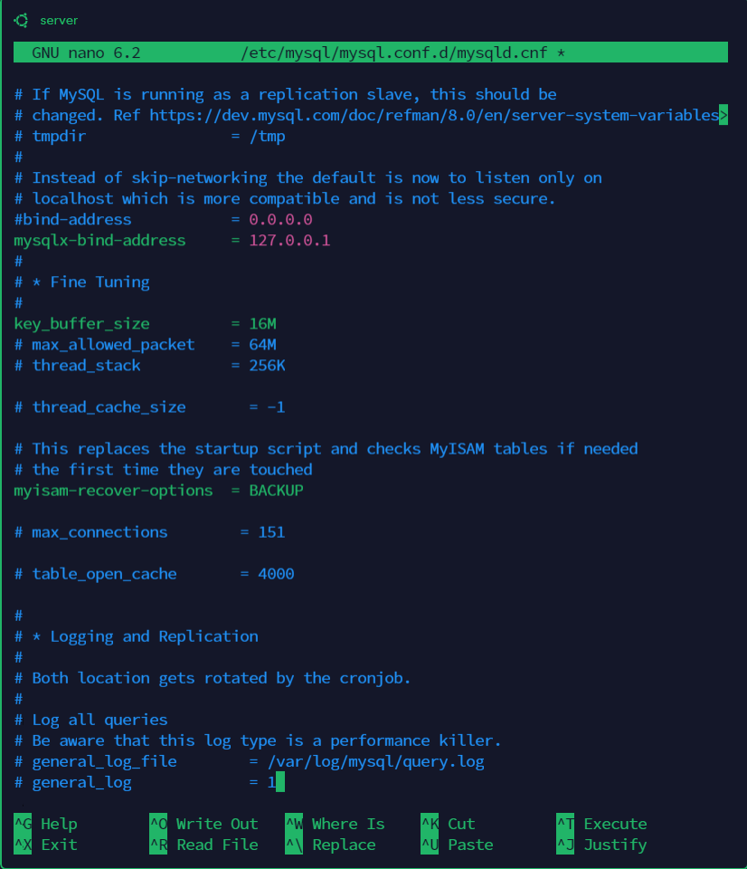

IMPLIMENTING CLIENT SERVER ACHITECTURE USING MYSQL DATABASE MANAGEMENT SYSTEM

**MYSQL SERVER**
   -   Created an ubuntu instance in AWS with name as **SERVER** 
   -   Updated it  using **sudo apt update** command 
   -  Installed mysql-sever  using **|Sudo apt install mysql-server -y**|

   - Logged in to **mysql-server** using **sudo mysql** commad
   -  Updated mysql-server root user password using **ALTER USER 'root'@'localhost' IDENTIFIED WITH mysql_native_password BY 'Password.1';**

   

   - I created another mysql user called |**myuser**| with password using **CREATE USER 'myuser'@'172.31.39.205' IDENTIFIED BY 'Password.1';** command

   -  Granted full privilage to the USER using **GRANT ALL PRIVILEGES ON *.* TO 'myuser'@'172.31.39.205' WITH GRANT OPTION;**  followed by **FLUSH PRIVILEGES;** command 

   - **In AWS server instance , I added inbound rule to allow client  private Ip address to connect to mysql server at port 3306** as shown bellow 

- Using **nano** command, Edited mysql-server config file and commented out the first blind ip address to render it invalid as shown bellow.

-  With this command, **sudo service mysql restart**,  i restarted mysql-server to make changes take effect.

    **MYSQL-CLIENT** 

    -  In AWS, i craeted another instance called **CLIENT** 

    - With sudo apt update, I updated the instance.

    -  With sudo apt **install mysql-client**, I installed mysql client.

    Finally, from this client instance, I connected to **mySQL-server** using **mysql -u myuser -h 172.31.38.59 -p** command. 

   -  **Show databases;**

    
 
